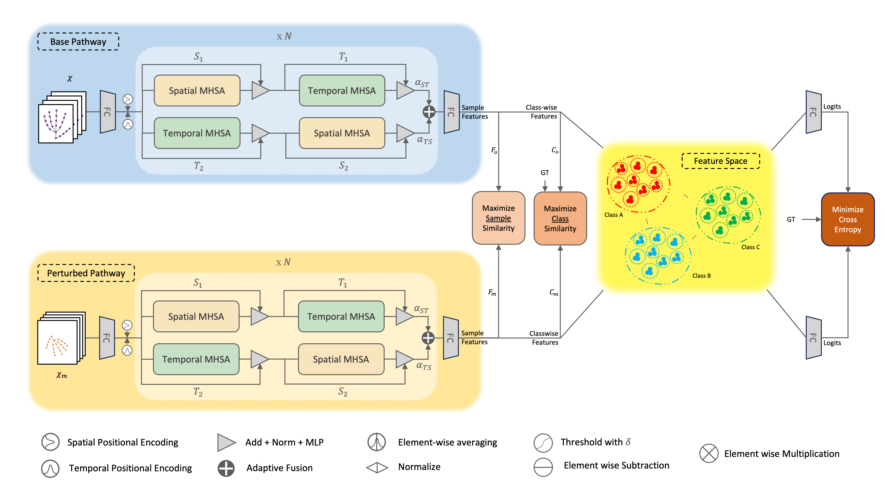

# GestureCLR: Contrastive Learning for Robust Skeletal Gesture Recognition


This is the PyTorch implementation of the skeleton-based gesture recognition project for Topics in Autonomous Robotics, EPFL 2023

<p align="center">

</p>

## Installation

```bash
conda create -n GestureCLR python=3.7 anaconda
conda activate GestureCLR
# Please install PyTorch according to your CUDA version.
conda install pytorch torchvision torchaudio pytorch-cuda=11.6 -c pytorch -c nvidia
pip install -r requirements.txt
```

## Data

We use the [HaGRID](https://github.com/hukenovs/hagrid) dataset. We provide the extracted hand skeleton data, 22 joints per hand, in this [GDrive](https://drive.google.com/drive/folders/1XiRBjCZe4QNzOS8A22xr7Y-l8cJatBUr?usp=share_link).

## Running

**Train from scratch:**

```shell
python train_action_hagrid.py \
    --config configs/action/MB_ft_hagrid.yaml \
    --checkpoint exps/hagrid 
```

**Evaluate:**

```bash
python train_action_hagrid.py \
--config configs/action/MB_ft_hagrid.yaml \
--evaluate path_to_model_weights

```
## Model Weights

We provide the model weights in this [GDrive](https://drive.google.com/drive/folders/1L--GsFHhy-DgqUug2u1NPMb7ehjDV-A_?usp=share_link).


## Acknowledgement
The framework of our code is extended from the following repositories. We sincerely thank the authors for releasing the codes.
- The framework of our code is based on [MotionBERT](https://github.com/Walter0807/MotionBERT).
- The dataset is from [HaGRID](https://github.com/hukenovs/hagrid).

## Licence

This project is licensed under the terms of the MIT license.